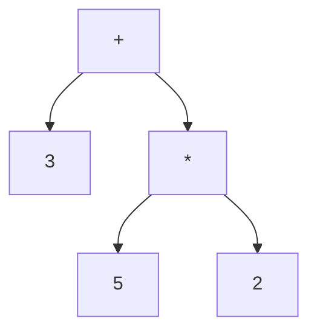

# Automated Lecture Notes

## Indice
- [1 Oggi Parliamo File](#1-oggi-parliamo-file)

---

## 1 Oggi Parliamo File

### 1.1 Definizioni e concetti chiave

**journaling**: una tecnica che registra le modifiche ai metadata.

### 1.2 Esempi

> **Esempio**: EXT3 usa un log per ridurre il rischio di corruzione.

### 1.3 Visualizzazioni

### Esercizi
- Riassumi i concetti principali della sezione Oggi Parliamo File.
- Applica oggi parliamo file a un caso di studio discusso a lezione.
